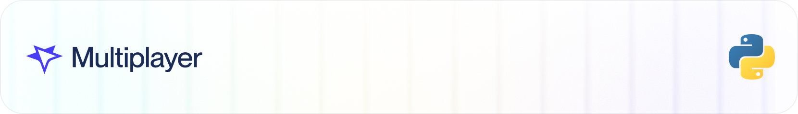

<div align="center">
<a href="https://github.com/multiplayer-app/multiplayer-session-recorder-python">
  
</a>
  <a href="https://github.com/multiplayer-app/multiplayer-session-recorder-python/blob/main/LICENSE">
    
  </a>
  <a href="https://multiplayer.app">
    
  </a>
  
</div>
<div>
  <p align="center">
    <a href="https://x.com/trymultiplayer">
      
    </a>
    <a href="https://www.linkedin.com/company/multiplayer-app/">
      
    </a>
    <a href="https://discord.com/invite/q9K3mDzfrx">
      
    </a>
  </p>
</div>

# Multiplayer Python Full Stack Session Recorder

## Introduction

The `multiplayer-session-recorder` module integrates OpenTelemetry with the Multiplayer platform to enable seamless trace collection and analysis. This library helps developers monitor, debug, and document application performance with detailed trace data. It supports flexible trace ID generation, sampling strategies.

## Installation

To install the `multiplayer-session-recorder` module, use the following command:

```bash
pip install multiplayer-session-recorder
```


Library supports optional dependencies for web framework integrations:

```bash
# For Django support
pip install multiplayer-session-recorder[django]

# For Flask support
pip install multiplayer-session-recorder[flask]

# For both Django and Flask support
pip install multiplayer-session-recorder[all]
```

## Set up Session Recorder client

```python
from multiplayer_session_recorder import (
  session_recorder,
  SessionType,
  SessionRecorderRandomIdGenerator
)
from .opentelemetry import id_generator

id_generator = SessionRecorderRandomIdGenerator()

session_recorder.init(
  apiKey = "{{YOUR_API_KEY}}",
  traceIdGenerator = idGenerator,
  resourceAttributes = {
    "serviceName": "{{SERVICE_NAME}}",
    "version": "{{SERVICE_VERSION}}",
    "environment": "{{PLATFORM_ENV}}",
  }
)

# ...

await session_recorder.start(
    SessionType.PLAIN,
    {
      name: "This is test session",
      sessionAttributes: {
        accountId: "687e2c0d3ec8ef6053e9dc97",
        accountName: "Acme Corporation"
      }
    }
  )

  # do something here

await session_recorder.stop()
```

## Session Recorder trace Id generator

```python
from multiplayer_session_recorder import SessionRecorderRandomIdGenerator

id_generator = SessionRecorderRandomIdGenerator()
```

## Session Recorder trace id ratio based sampler

```python
from multiplayer_session_recorder import SessionRecorderTraceIdRatioBasedSampler

sampler = SessionRecorderTraceIdRatioBasedSampler()
```


## Setup backend

### Setup opentelemetry data

Use officials opentelemetry guidence from [here](https://opentelemetry.io/docs/languages/python) or [zero-code](https://opentelemetry.io/docs/zero-code/python/) approach

### Send opentelemetry data to Multiplayer

Opentelemetry data can be sent to Multiplayer's collector in few ways:

### Option 1 (Direct Exporter):

```python
from opentelemetry.exporter.otlp.proto.http.trace_exporter import OTLPSpanExporter
  
traceExporter = OTLPSpanExporter(
  endpoint = "https://otlp.multiplayer.app/v1/traces",
  headers = { "authorization": "{{MULTIPLAYER_OTLP_KEY}}" }
)
```

or

```python
from multiplayer_session_recorder.exporter.http.trace_exporter import (
    OTLPSpanExporter as SessionRecorderOTLPSpanExporter
)

traceExporter = SessionRecorderOTLPSpanExporter(
    endpoint = "https://otlp.multiplayer.app/v1/traces", # optional
    api_key = MULTIPLAYER_OTLP_KEY
)
```

### Option 2 (Collector):

Another option - send otlp data to [opentelemetry collector](https://github.com/multiplayer-app/multiplayer-otlp-collector).

Use following examples to send data to collector

```python
from opentelemetry.exporter.otlp.proto.http.trace_exporter import OTLPSpanExporter

traceExporter = OTLPSpanExporter(
  endpoint = "http://{{OTLP_COLLECTOR_URL}}/v1/traces",
  headers = { "authorization": "{{MULTIPLAYER_OTLP_KEY}}" }
)
```

or

```python
from multiplayer_session_recorder.exporter.http.trace_exporter import (
    OTLPSpanExporter as SessionRecorderOTLPSpanExporter
)

traceExporter = SessionRecorderOTLPSpanExporter(
    endpoint = "http://{{OTLP_COLLECTOR_URL}}/v1/traces", # optional
    api_key = MULTIPLAYER_OTLP_KEY
)
```

## Add request/response payloads

### Option 1 (middleware):
### Django HTTP Payload Recorder Middleware

First, install Django support:

```bash
pip install multiplayer-session-recorder[django]
```

Then use the middleware in your Django settings:

```python
from multiplayer_session_recorder import create_django_middleware

MIDDLEWARE = [
    # ...
    'multiplayer_session_recorder.middleware.django_http_payload_recorder.DjangoOtelHttpPayloadRecorderMiddleware',
    # Add the payload recorder middleware
    create_django_middleware({
        "captureBody": True,
        "captureHeaders": True,
        "maxPayloadSizeBytes": 10000,
        "isMaskBodyEnabled": True,
        "maskBodyFieldsList": ["password", "token"],
        "isMaskHeadersEnabled": True,
        "maskHeadersList": ["authorization"],
    }),
]
```

### Flask HTTP Payload Recorder Middleware

First, install Flask support:

```bash
pip install multiplayer-session-recorder[flask]
```

Then use the middleware in your Flask application:

```python
from flask import Flask
from multiplayer_session_recorder.middleware.flask_http_payload_recorder import FlaskOtelHttpPayloadRecorderMiddleware
from multiplayer_session_recorder.types.middleware_config import HttpMiddlewareConfig

app = Flask(__name__)

# Create middleware functions
middleware_config = HttpMiddlewareConfig(
    captureBody=True,           # Capture request/response bodies
    captureHeaders=True,        # Capture request/response headers
    maxPayloadSizeBytes=10000,  # Maximum payload size to capture
    isMaskBodyEnabled=True,     # Enable masking of sensitive body fields
    maskBodyFieldsList=["password", "token", "secret", "api_key"],  # Fields to mask
    isMaskHeadersEnabled=True,  # Enable masking of sensitive headers
    maskHeadersList=["authorization", "x-api-key", "cookie"],       # Headers to mask
)

# Create middleware functions using the direct middleware class
before_request, after_request = FlaskOtelHttpPayloadRecorderMiddleware(middleware_config)


# Register the middleware
app.before_request(before_request)
app.after_request(after_request)

@app.route('/')
def hello():
    return 'Hello, World!'
```

### Option 2 (Envoy proxy):

Deploy [Envoy Proxy](https://github.com/multiplayer-app/multiplayer-proxy) in front of your backend service.

## License

MIT — see [LICENSE](./LICENSE).
